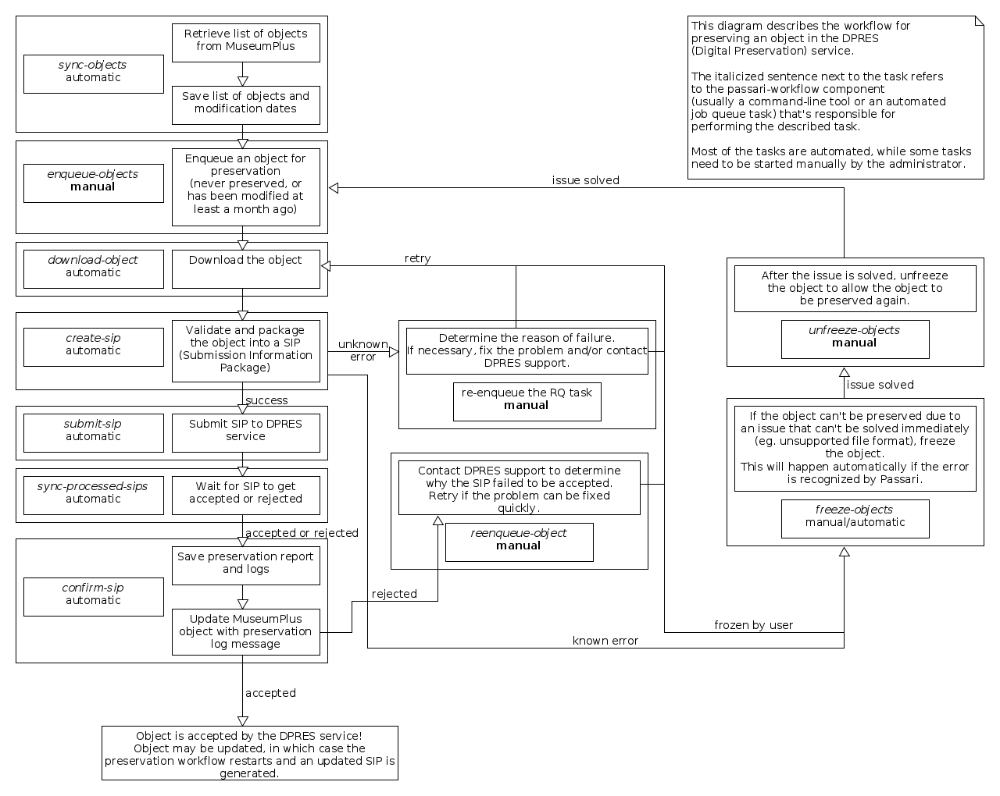

Architecture
============

Environment
-----------

A functional *Passari Workflow* instance consists of a PostgreSQL server, a Redis server and one or more *worker servers*. In practice, you may only need one server with *PostgreSQL* and *Redis* services and another server with a *Passari Workflow* service.

A worker server has a configured *Passari Workflow* installation and has at least some RQ workers active. In addition, it can have:

- A *Passari Web UI* installation, which is installed in the same virtualenv as *Passari Workflow* itself. This web UI can be deployed using a web server and an WSGI application server: one example is using the web server *nginx* and WSGI application server *uWSGI*.
- Automated tasks (``sync-objects``, ``sync-attachments`` and ``sync-hashes``). Only one of these tasks can be running at a time among all the worker servers.

Database
--------

Python library `SQLAlchemy <https://docs.sqlalchemy.org/>`_ is used for defining the schema and performing database operations, and `Alembic <https://alembic.sqlalchemy.org/en/latest/>`_ is used for creating and running database migrations.

After modifying the database schema, create a new migration using Alembic:

.. code-block:: console

   $ alembic revision --autogenerate -m 'add MuseumObject.foobar'

This will autogenerate a migration inside the `alembic/versions` directory, which you can update accordingly.

.. warning::

   Test that the migration is correct and modify it if needed. Auto-generated migrations do not detect all changes!

Workflow diagram
----------------

